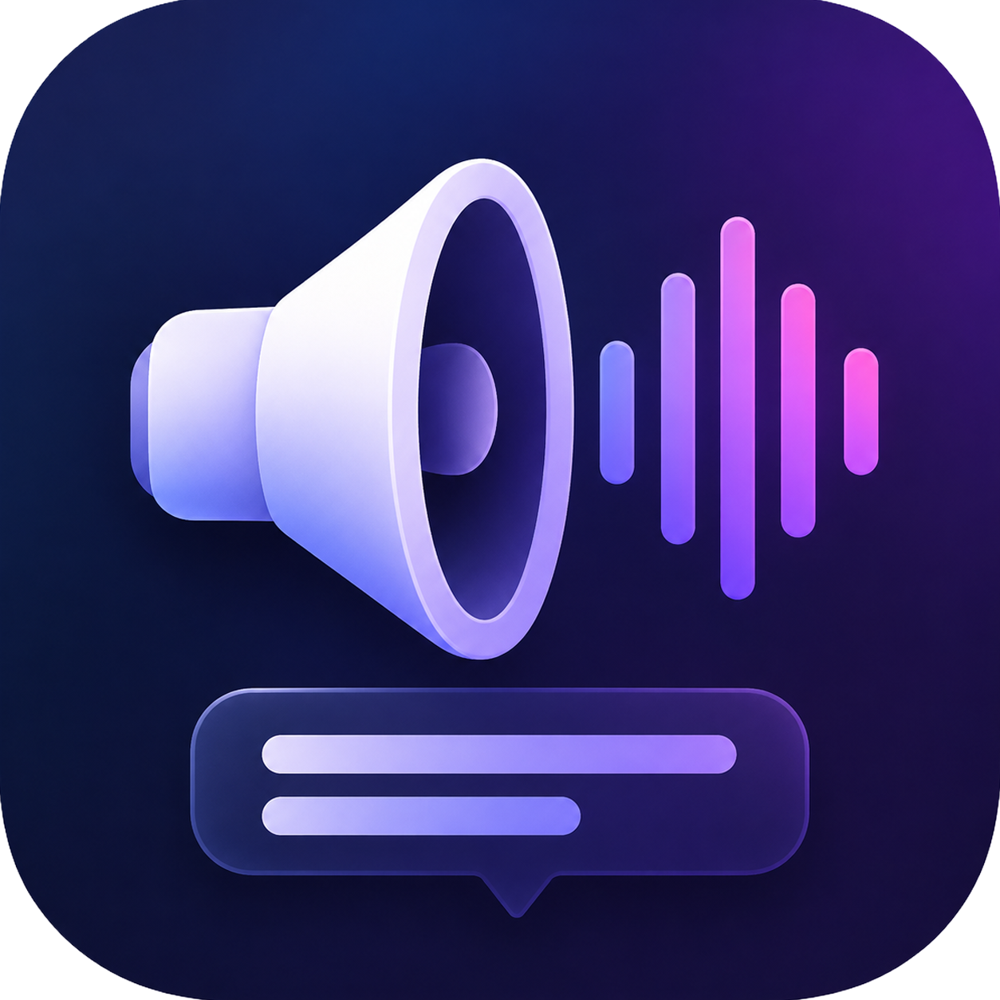
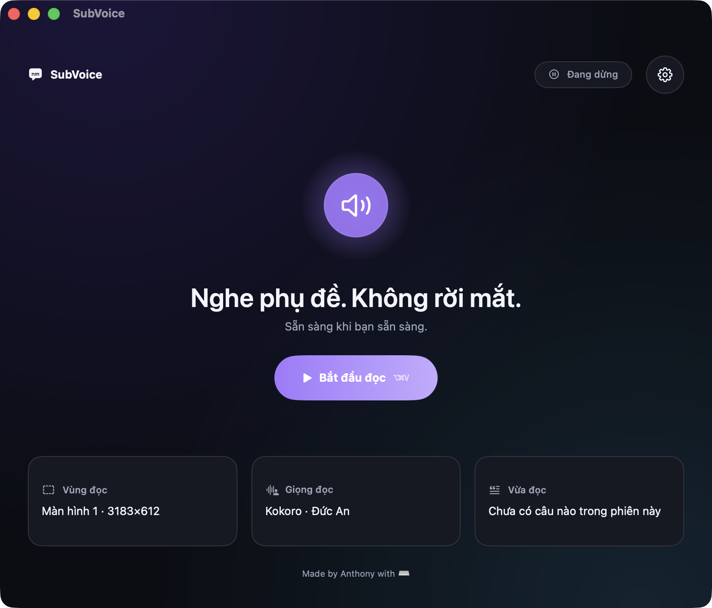
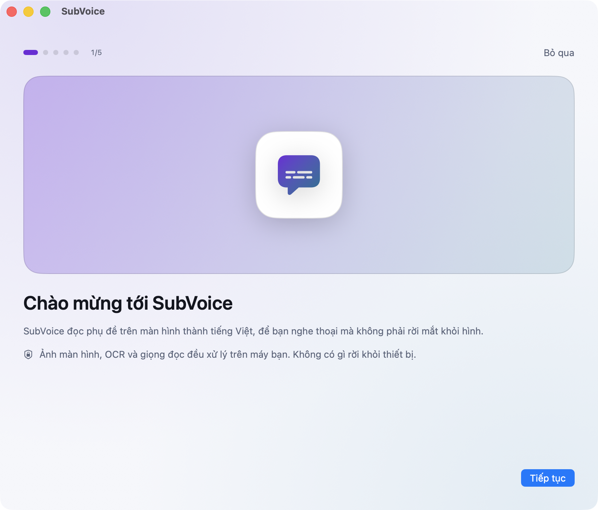

<div align="center">



# SubVoice

### Nghe phụ đề. Không rời mắt khỏi phim.

**Đọc phụ đề tiếng Việt trên màn hình thành giọng nói — riêng tư, offline, dành cho macOS.**

[](https://support.apple.com/macos)
[](#yêu-cầu)
[](https://www.swift.org/)
[](#quyền-riêng-tư)
[](#kiểm-thử)

[**⬇️ Tải về**](#tải-về) · [Tính năng](#tính-năng) · [Cách hoạt động](#cách-hoạt-động) · [Quyền riêng tư](#quyền-riêng-tư)

<br>



</div>

---

Bạn đang xem một bộ phim có phụ đề tiếng Việt, nhưng mắt phải chạy theo chữ thay vì xem diễn xuất. SubVoice khoanh vùng phụ đề trên màn hình, nhận diện chữ, rồi đọc thành tiếng — bạn nghe thoại và nhìn hình.

Hoạt động với **mọi nguồn**: Netflix, YouTube, trình phát cục bộ, phụ đề dạng lớp HTML. Miễn là chữ hiện trên màn hình.

## Tải về

<div align="center">

### [⬇️ Tải SubVoice cho macOS](https://github.com/hoanganhuynh/subvoice/releases/latest)

`SubVoice-0.1.0.zip` · 2,7 MB · macOS 14+ · Apple Silicon

</div>

Giải nén rồi kéo `SubVoice.app` vào thư mục **Applications**. Mở app, một hướng dẫn 5 bước sẽ đưa bạn qua phần cấp quyền và chọn vùng phụ đề.

> [!IMPORTANT]
> Ở bước cấp quyền **Screen Recording**, sau khi bật trong System Settings bạn phải **thoát SubVoice rồi mở lại**. macOS chỉ áp dụng quyền này ở lần khởi động kế tiếp — app không tự làm được, và đây không phải lỗi.

<div align="center">

</div>

## Tính năng

| | |
| --- | --- |
| 🎯 **Focus First** | Trạng thái và nút bật/tắt chiếm trung tâm. Ba thẻ điều khiển gọn ở đáy: vùng đọc, giọng đọc, câu vừa đọc. |
| 🗣️ **Hai bộ đọc offline** | Giọng hệ thống phản hồi trong ~50 ms. Kokoro tự nhiên hơn với **14 giọng Việt**, tải khi bạn cần. |
| 🎛️ **Voice Studio** | Đổi bộ đọc, giọng, tốc độ, âm lượng và nghe thử ngay — không cần dừng phim. |
| 🧠 **Không đọc lặp** | Phụ đề đứng yên thì im lặng. Xử lý được cả phụ đề fade-in và cảnh đổi nhanh. |
| 📋 **Lịch sử phiên** | Tìm kiếm và sao chép câu đã đọc. Chỉ nằm trong bộ nhớ, tự xoá khi thoát app. |
| ⌨️ **Phím tắt toàn cục** | Hoạt động cả khi video đang toàn màn hình ở app khác. |
| 🩺 **Chẩn đoán tại chỗ** | Quyền, giọng hệ thống, tình trạng Kokoro — mỗi mục kèm nút xử lý. |
| 🌓 **Sáng, tối, theo hệ thống** | Tôn trọng Increase Contrast và Reduce Motion. Dùng được hoàn toàn bằng bàn phím và VoiceOver. |
| 🔒 **Không gửi gì ra mạng** | Ảnh màn hình, OCR và giọng đọc đều xử lý trên máy bạn. |

## Cách hoạt động

```text
   Vùng màn hình bạn chọn
            │
            ▼
   ScreenCaptureKit          bắt hình liên tục
            │
            ▼
   ChangeDetector            chỉ chạy tiếp khi chữ đổi
            │
            ▼
   Vision OCR                nhận diện tiếng Việt có dấu
            │
            ▼
   TextGate                  chuẩn hoá, lọc trùng
            │
            ▼
   SpeechQueue               FIFO, không bỏ câu
            │
            ▼
   Giọng hệ thống / Kokoro ──▶ 🔊
```

Chìa khoá nằm ở `ChangeDetector`: OCR chỉ chạy khi chữ ký độ sáng của vùng phụ đề thay đổi. Nhờ vậy app không đốt CPU để nhận diện đi nhận diện lại cùng một câu, và cũng không đọc lặp.

## Giọng đọc

### Hệ thống — nhanh

`AVSpeechSynthesizer` với giọng **Linh** (`vi-VN`). Độ trễ khoảng 50 ms nên bám sát được phụ đề realtime. Có sẵn trên macOS, không cần tải gì.

Máy chưa có giọng Việt: `System Settings → Accessibility → Spoken Content → System Voice`.

### Kokoro — tự nhiên, offline

Model neural [Kokoro-Vietnamese](https://github.com/iamdinhthuan/Kokoro-Vietnamese) chạy qua ONNX Runtime với 14 voice pack. Tổng hợp khoảng 1–1,6 giây mỗi câu.

**Cài ngay trong app:** Voice Studio hoặc **Cài đặt → Chẩn đoán → Kokoro** → *Tải giọng Kokoro*.

Gói nặng **680 MB** và đã gồm sẵn một bản Python relocatable — **máy bạn không cần cài Python**. App đối chiếu SHA-256 trước khi cài, và cài xong thì 14 giọng xuất hiện ngay mà không phải khởi động lại. Trong lúc tải app vẫn dùng bình thường; thoát giữa chừng thì lần sau tải tiếp.

Năm mức tốc độ ánh xạ sang dải `0,65×–1,55×`. Thay đổi có hiệu lực từ câu kế tiếp.

## Phím tắt

| Phím | Hành động |
| --- | --- |
| <kbd>⌥</kbd> <kbd>⌘</kbd> <kbd>V</kbd> | Bật hoặc tắt đọc |
| <kbd>⌥</kbd> <kbd>⌘</kbd> <kbd>R</kbd> | Chọn lại vùng phụ đề |
| <kbd>⌘</kbd> <kbd>Q</kbd> | Thoát hẳn |

Đóng cửa sổ **không** làm SubVoice dừng. App tiếp tục chạy trên menu bar và câu đang đọc không bị ngắt. Bấm Dock icon hoặc **Mở SubVoice** trên menu bar để hiện lại cửa sổ.

## Quyền riêng tư

Toàn bộ pipeline chạy trên máy bạn. Không có API phân tích, không quảng cáo, không đồng bộ đám mây.

- ScreenCaptureKit chỉ lấy đúng vùng bạn khoanh, không phải cả màn hình.
- Vision nhận diện chữ cục bộ.
- Linh và Kokoro đều tổng hợp giọng offline.
- **Lịch sử phiên chỉ nằm trong bộ nhớ tiến trình**, tối đa 200 câu, biến mất khi thoát app. Nó không được ghi vào `UserDefaults` hay bất kỳ file log nào.

SubVoice không cần quyền Microphone, Accessibility hay Input Monitoring.

## Yêu cầu

- macOS 14 trở lên
- **Apple Silicon** — giọng Kokoro chỉ có bản arm64; máy Intel vẫn dùng được giọng hệ thống
- Quyền **Screen Recording**
- Giọng tiếng Việt của macOS nếu dùng bộ đọc hệ thống

## Build từ nguồn

```bash
git clone https://github.com/hoanganhuynh/subvoice.git
cd subvoice
./Scripts/bundle.sh release
open ~/Applications/SubVoice.app
```

> [!NOTE]
> Script cài vào `~/Applications/SubVoice.app`. Giữ đường dẫn và chữ ký ổn định giúp macOS không hỏi lại quyền Screen Recording sau mỗi lần build. Đặt `SUBVOICE_SIGN_IDENTITY` để dùng chứng chỉ của bạn.

### Đóng gói lại Kokoro (người bảo trì)

```bash
./Scripts/package-kokoro.sh 1.0.0
```

Script dựng CPython relocatable, cài dependency bằng `pip install --target` (không venv), tải model, convert voicepack sang `.npy`, cắt bỏ stack PyTorch, rồi **chạy self-test dưới `env -i`** trước khi nén — self-test hỏng thì archive không được tạo.

Nó in ra `SHA256` và `SIZE`; dán hai giá trị đó vào `KokoroPackage.current` rồi attach archive vào GitHub Release trùng tag.

## Kiến trúc

```text
Sources/
├── SubVoiceApp/      # Vòng đời AppKit: cửa sổ, menu bar, capture, OCR, TTS, installer
├── SubVoiceUI/       # State trình bày và toàn bộ view SwiftUI
├── SubVoiceCore/     # Detector, lọc văn bản, hàng đợi, lịch sử, cài đặt, gói Kokoro
└── SubVoiceProbe/    # Công cụ đo OCR/capture

Scripts/
├── bundle.sh         # Build, ký và cài SubVoice.app
├── package-kokoro.sh # Đóng gói runtime Kokoro
├── smoke-overlay.sh  # Vòng đời overlay chọn vùng, chạy dưới NSZombie
├── smoke-window.sh   # Vòng đời cửa sổ chính
└── trace.sh          # Đọc trace chẩn đoán
```

`AppCoordinator` sở hữu mọi dịch vụ đang chạy và là **nơi duy nhất** tạo ra ảnh chụp trạng thái. Cửa sổ SwiftUI và menu bar cùng đọc một `AppViewState` và chỉ gửi `AppIntent` ngược lại — nên hai nơi không thể hiển thị lệch nhau.

Logic đáng test nằm ở `SubVoiceCore` và `SubVoiceUI` (đều là value type thuần), còn `SubVoiceApp` chỉ giữ phần chạm hệ thống.

## Kiểm thử

```bash
swift test                  # 119 test, 11 suite
./Scripts/smoke-overlay.sh  # overlay dưới NSZombie
./Scripts/smoke-window.sh   # vòng đời cửa sổ
```

Bật trace khi cần tìm câu bị bỏ qua:

```bash
open ~/Applications/SubVoice.app --args --trace
./Scripts/trace.sh 100
```

## Giới hạn đã biết

- Chỉ đọc chữ đang hiển thị trong vùng bạn đã chọn.
- Nội dung DRM có thể chặn Screen Recording; phụ đề dạng lớp HTML bên ngoài video thường vẫn đọc được.
- Kokoro tự nhiên hơn nhưng chậm hơn đáng kể so với giọng hệ thống.
- Gói Kokoro chỉ có bản Apple Silicon.
- Hiện tập trung vào tiếng Việt và macOS.

## Ghi nhận

- [Kokoro-Vietnamese](https://github.com/iamdinhthuan/Kokoro-Vietnamese) — model và frontend tiếng Việt, giấy phép Apache-2.0
- [contextboxai/Kokoro-Vietnamese](https://huggingface.co/contextboxai/Kokoro-Vietnamese) — ONNX model và voice packs
- [python-build-standalone](https://github.com/astral-sh/python-build-standalone) — bản CPython relocatable trong gói runtime
- Apple Vision, ScreenCaptureKit và AVFoundation

---

<div align="center">

**Made by Anthony with ⌨️**

</div>
